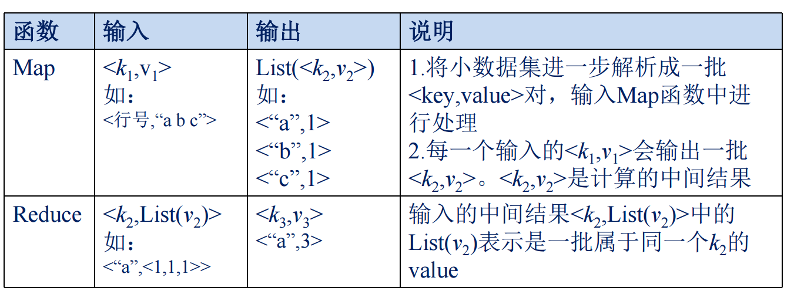

这张表详细说明了 **MapReduce** 模型中 **Map** 和 **Reduce** 两个核心函数的输入、输出及其解释。以下是逐行详细解读：

---

### **1. Map 函数**

#### 输入

- 格式：`<k1, v1>`
  - **k1**：代表输入的键（Key）。
  - **v1**：代表输入的值（Value）。
  - 示例：`<行号, "a b c">`  
    - 其中，`行号` 是键，`"a b c"` 是值，表示一行的文本内容。

#### 输出

- 格式：`List(<k2, v2>)`
  - **k2**：代表输出的键（Key）。
  - **v2**：代表输出的值（Value）。
  - 输出是一个列表，每个元素是一个键值对 `<k2, v2>`。
  - 示例：
    - `<<“a”, 1>, <“b”, 1>, <“c”, 1>>`
    - 表示输入的每个单词都会被转换为一个键值对，键是单词本身，值是数字 1。

#### 说明

1. **数据解析**：
   - Map 函数将输入数据集解析为一系列 `<key, value>` 对。
   - 在示例中，每行文本（如 `"a b c"`）被分割成单词，每个单词作为一个键，值为 `1`。
2. **生成中间结果**：
   - 每对输入 `<k1, v1>` 会输出一系列中间键值对 `<k2, v2>`。
   - 在单词计数的例子中，`k2` 是单词，`v2` 是单词出现的次数（初始值为 1）。

---

### **2. Reduce 函数**

#### 输入

- 格式：`<k2, List(v2)>`
  - **k2**：表示一个中间结果的键（Key），例如单词。
  - **List(v2)**：表示键 `k2` 对应的值的列表，通常由 Map 阶段的输出聚合而成。
  - 示例：`<"a", <1, 1, 1>>`
    - 这里 `k2 = "a"` 表示单词 "a"，`List(v2) = <1, 1, 1>` 表示单词 "a" 在不同分片中分别出现了 1 次。

#### 输出

- 格式：`<k3, v3>`
  - **k3**：Reduce 阶段的输出键，通常与输入的 `k2` 相同。
  - **v3**：Reduce 阶段的输出值，通常是通过聚合 `List(v2)` 得到的结果。
  - 示例：`<"a", 3>`
    - 表示单词 "a" 出现了 3 次。

#### 说明

- Reduce 函数会对每个键 `k2` 的值列表 `List(v2)` 进行聚合计算。
- 聚合结果是 `<k3, v3>`，其中 `k3` 是输入的键，`v3` 是聚合后的结果（如单词计数的总和）。

---

### **总结：MapReduce 的核心流程**

1. **Map 阶段（分解任务）**：
   - 将大规模输入数据集分解为 `<k1, v1>` 对，通过 Map 函数转化为中间键值对 `<k2, v2>`。
   - 示例：对输入文本逐行解析，输出单词及其初始计数。

2. **Shuffle 阶段（聚合中间结果）**：
   - 将 Map 阶段输出的中间键值对 `<k2, v2>` 按照键 `k2` 进行分组，形成 `<k2, List(v2)>`。

3. **Reduce 阶段（汇总结果）**：
   - 对每个 `k2` 的值列表 `List(v2)` 进行聚合计算，输出最终结果 `<k3, v3>`。
   - 示例：统计每个单词的总出现次数。

---

### **应用场景：单词计数示例**

- 输入：多行文本（如 `“a b c”`）。
- Map 阶段：
  - 输入：`<行号, "a b c">`
  - 输出：`<<“a”, 1>, <“b”, 1>, <“c”, 1>>`
- Reduce 阶段：
  - 输入：`<"a", <1, 1, 1>>`
  - 输出：`<"a", 3>`，表示单词 "a" 出现了 3 次。

### **优势**

- **分而治之**：将大规模数据分片并行处理。
- **容错性强**：中间结果可以保存，部分节点故障时可以重试。
- **通用性高**：适用于大规模数据处理中的统计分析任务。

通过这张表的解析，MapReduce 的数据流和核心思想清晰可见，尤其在大数据处理场景中应用广泛。
