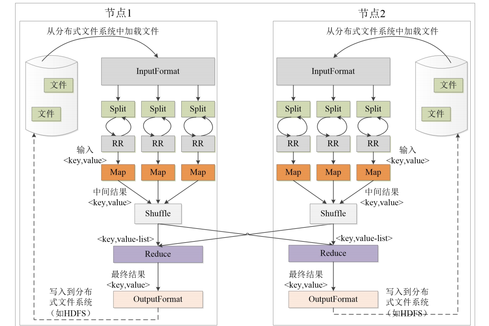

### MapReduce：分布式计算的核心框架  

#### 1. MapReduce的定义与背景  

MapReduce是一种分布式计算模型，最早由Google提出，用于处理大规模数据集的并行计算。其核心思想是将复杂的计算任务分解为Map和Reduce两个阶段，分别负责数据的映射和归约。MapReduce的设计目标是简化分布式编程，使开发者无需关注底层的数据分布和任务调度，只需专注于业务逻辑的实现。  

#### 2. MapReduce的工作原理  

MapReduce的工作流程可以分为以下几个阶段：  

- **Map阶段**：输入数据被切分为多个分片（split），每个分片由一个Map任务处理。Map任务将输入数据转换为键值对（key-value pairs），并输出中间结果。  
- **Shuffle阶段**：Map输出的中间结果根据key进行分区（partition）和排序（sort），并传输到对应的Reduce任务。  
- **Reduce阶段**：Reduce任务接收来自多个Map任务的中间结果，对相同key的value进行归约操作，最终输出计算结果。  

#### 3. MapReduce的应用场景  

MapReduce广泛应用于以下领域：  

- **搜索引擎索引构建**：通过MapReduce可以高效地构建倒排索引，支持快速的全文检索。  
- **日志分析**：MapReduce可以处理海量日志数据，统计用户行为、异常访问等。  
- **社交网络分析**：通过MapReduce计算用户关系、影响力等指标。  
- **机器学习与数据挖掘**：MapReduce支持大规模数据的特征提取、模型训练等任务。  

#### 4. MapReduce的优缺点  

**优点**：  

- **易于编程**：开发者只需实现Map和Reduce函数，无需关注分布式系统的复杂性。  
- **高扩展性**：通过增加节点可以线性扩展计算能力。  
- **高容错性**：系统自动处理节点故障，确保任务的可靠执行。  

**缺点**：  

- **不擅长实时计算**：MapReduce适合离线处理，无法在毫秒级返回结果。  
- **不擅长流式计算**：输入数据必须是静态的，无法处理动态数据。  
- **数据倾斜问题**：某些key的数据量过大可能导致任务不均衡。  

#### 5. MapReduce的实际案例  

以**单词计数**为例，MapReduce的实现步骤如下：  

- **Map阶段**：将输入文本切分为单词，输出<单词, 1>的键值对。  
- **Reduce阶段**：对相同单词的value进行累加，输出<单词, 单词出现次数>的结果。  

#### 6. MapReduce的未来发展  

随着大数据技术的不断发展，MapReduce在某些场景下逐渐被Spark等内存计算框架取代。然而，MapReduce仍然在大规模离线数据处理中占据重要地位，尤其是在Hadoop生态系统中。未来，MapReduce可能会与流处理、图计算等技术进一步融合，以应对更复杂的计算需求。  

通过以上分析，我们可以看到MapReduce作为一种经典的分布式计算模型，在大数据处理领域具有不可替代的价值。尽管面临一些挑战，但其简单易用、高扩展性和高容错性等特点，使其仍然是许多企业和研究机构的首选工具。

---

这张图片探讨了为什么在已有传统并行计算框架（如 MPI）的情况下，谷歌仍然提出了 **MapReduce**，并列出了 MapReduce 相较于传统并行计算框架的优势。以下是详细的解释：

---

### **问题**：为什么谷歌需要 MapReduce？它相较传统的并行计算框架有哪些优势？

在 MapReduce 出现之前，传统并行计算框架（如 MPI）已经非常成熟，但它们在特定情况下存在一些局限性，谷歌提出的 MapReduce 针对这些问题进行了优化，以下是两者在核心方面的比较。

---

### 1. **集群架构/容错性**

- **传统并行计算框架**：  
  - 采用**共享式架构**（共享内存/共享存储），即多个计算节点共享同一个存储或内存系统。
  - **缺点**：共享式架构的容错性较差，某个节点的故障可能会影响整个系统的运行。  
- **MapReduce**：  
  - 使用**非共享式架构**，每个节点独立运行，节点之间通过中间数据（如文件系统）进行通信。
  - **优点**：非共享架构容错性更好，某个节点故障后可以自动重新分配任务，确保系统继续运行。

---

### 2. **硬件/价格/扩展性**

- **传统并行计算框架**：  
  - 需要依赖高性能的硬件资源，例如刀片服务器、高速网络（如 SAN），这些设备价格昂贵。
  - **扩展性差**：由于成本高昂，扩展系统的规模会受到限制。  
- **MapReduce**：  
  - 依赖于普通的廉价硬件（如普通 PC 服务器），使用分布式系统代替高端硬件。
  - **扩展性好**：可以轻松地通过增加廉价节点来扩展计算能力，适合大规模数据处理需求。

---

### 3. **编程/学习难度**

- **传统并行计算框架**：  
  - 开发复杂，编程难度高，开发者需要关注**具体的并行实现细节**（如任务划分、通信、同步等）。  
  - **难点**：开发者需要深入了解 "what-how"，即不仅需要知道实现目标，还需要理解如何将目标转化为并行计算任务。  
- **MapReduce**：  
  - 开发简单，只需要关注 "what"（需要实现什么功能），而不需要关注具体的并行任务分解和调度。  
  - **优点**：开发者只需定义 Map 和 Reduce 两个阶段的逻辑，系统自动负责并行执行和容错处理。

---

### 4. **适用场景**

- **传统并行计算框架**：  
  - 适合处理**实时、细粒度的计算任务**，如高性能科学计算、计算密集型的模型模拟等。  
- **MapReduce**：  
  - 更适合**批处理任务**，尤其是**非实时性**、**数据密集型任务**，如大数据分析、日志处理、搜索引擎索引构建等。

---

### **总结：MapReduce 的优势**

1. **容错性强**：非共享架构更稳定，节点故障不会影响整体运行。
2. **成本低、扩展性好**：通过使用普通 PC 服务器和分布式架构，降低硬件成本，且易于扩展。
3. **编程简单**：隐藏了复杂的并行细节，降低开发难度。
4. **适用数据密集型场景**：针对批处理和大规模数据处理任务设计，效率更高。

---

因此，MapReduce 的提出不仅解决了传统并行框架的局限性，也在大数据处理领域开辟了新天地，推动了分布式计算的普及和发展。

---

这张图片系统地介绍了 **MapReduce 的体系结构** 和 **工作流程**，具体描述了组成部分以及各部分的职责与交互关系。以下是详细解释：

---

### **1. MapReduce 的体系结构**

MapReduce 的体系结构主要由以下 **4 个部分** 组成：**Client、JobTracker、TaskTracker、Task**。

#### **1) Client**

- **功能**：
  - 用户通过 Client 提交 MapReduce 程序到 **JobTracker**。
  - Client 负责用户与 MapReduce 集群的交互，用户可以通过 Client 查看作业运行状态。
- **特点**：
  - Client 是用户提交作业的接口，通常提供一些工具或命令行工具，便于操作。

---

#### **2) JobTracker**

- **功能**：
  - **核心控制组件**，负责整个系统的资源调度和作业监控。
  - **任务分配与容错**：
    - 监控所有 TaskTracker 和 Job 的状态。
    - 如果某个 TaskTracker 失败，JobTracker 会将对应的任务重新分配到其他节点。
  - 负责分配资源（如 CPU、内存）给不同任务，并与 **TaskScheduler** 协作以实现资源调度。
- **工作过程**：
  1. Client 提交作业到 JobTracker。
  2. JobTracker 将作业分解成多个 Map 和 Reduce 任务。
  3. JobTracker 分配任务到 TaskTracker 节点并监控任务运行状态。
  4. 收集执行完成的任务结果，汇总并反馈给 Client。

---

#### **3) TaskTracker**

- **功能**：
  - TaskTracker 是集群中的工作节点，负责运行具体的 **Map Task** 和 **Reduce Task**。
  - 定期通过 **心跳（Heartbeat）** 报告任务执行进度和节点健康状态给 JobTracker。
  - 接收 JobTracker 下发的指令（如分配新任务、杀死任务等），并执行相应操作。
- **资源管理**：
  - 使用 **slot** 概念管理资源（如 CPU、内存）。
  - 一个 TaskTracker 节点分为 **Map slot** 和 **Reduce slot**，分别为 Map Task 和 Reduce Task 分配计算资源。

---

#### **4) Task**

- **组成**：
  - 任务分为两种：**Map Task** 和 **Reduce Task**。
- **执行者**：
  - 任务是由 **TaskTracker** 启动的。
- **功能**：
  - Map Task 和 Reduce Task 是实际执行计算的单元。
  - Map Task 负责数据预处理、分片；Reduce Task 负责聚合结果。

---

### **2. MapReduce 的工作流程概述**

1. **作业提交**：
   - 用户通过 Client 提交作业到 JobTracker。
   - 作业会被分解为多个 Map 和 Reduce 任务。

2. **任务分配**：
   - JobTracker 根据集群中的可用资源，将任务分配到各个 TaskTracker 节点。

3. **任务执行**：
   - Map Task 和 Reduce Task 在 TaskTracker 节点上执行：
     - Map Task 处理输入数据并生成中间结果。
     - Reduce Task 对中间结果进行聚合计算，生成最终结果。

4. **监控与容错**：
   - TaskTracker 定期向 JobTracker 发送心跳信号，报告任务进度和节点状态。
   - 如果某个 TaskTracker 节点出现故障，JobTracker 会重新分配任务。

5. **结果汇总**：
   - 所有 Map 和 Reduce 任务完成后，结果被汇总并返回给用户。

---

### **3. 关键点解析**

#### **心跳机制（Heartbeat）**

- TaskTracker 周期性地向 JobTracker 报告自身状态。
- 如果 JobTracker 没有收到某个 TaskTracker 的心跳，则会认为该节点故障，并重新分配其任务。

#### **任务分片与 slot 分配**

- 一个任务需要占用一个 slot 才能运行。
- 任务调度器会根据 TaskTracker 的资源情况（如空闲 slot 数）分配任务。

#### **Master-Slave 架构**

- **Master（JobTracker）**：负责全局调度、资源管理和容错。
- **Slave（TaskTracker）**：负责具体任务的执行，并定期向 Master 汇报状态。

---

### **4. 优势分析**

1. **分布式架构**：任务被分布到不同节点并行执行，充分利用了集群资源。
2. **容错性强**：通过心跳机制和任务重试机制，系统能够应对节点故障。
3. **资源管理**：使用 slot 精细控制资源分配，提高系统利用率。

---

### **总结**

- **MapReduce 的体系结构**由 **Client、JobTracker、TaskTracker、Task** 组成，每个部分有明确的职责分工。
- **工作流程**通过分片、任务分配、执行和结果汇总，实现分布式计算的全流程。
- MapReduce 的设计充分考虑了分布式系统的容错性、可扩展性和资源高效利用，是大规模数据处理的经典框架。

---

这张图清晰展示了 **MapReduce 的完整执行流程**，包括数据从分布式文件系统的加载、Map 和 Reduce 阶段的处理，以及最终结果写回分布式文件系统的全过程。以下是详细解释：

---

### **整体架构**

- 图中展示了两个节点（节点1 和 节点2）的 MapReduce 处理流程。
- 数据从分布式文件系统（如 HDFS）加载，经过 **Map 阶段、Shuffle 阶段和 Reduce 阶段**，最终输出到分布式文件系统。

---

### **执行流程分解**

#### **1. 数据加载 (InputFormat)**

- **输入来源**：从分布式文件系统中加载数据文件。
- **InputFormat 的作用**：
  - 负责定义如何读取输入文件并将数据划分成多个 **Split（分片）**。
  - 每个 Split 是输入数据的一个逻辑分片，Map Task 会处理一个 Split。
- **示例**：对于一个大文件，可能会划分成多个小的 Split，每个 Split 对应一个 `<key, value>` 对。

---

#### **2. 分片 (Split) 和 RecordReader**

- **Split**：
  - InputFormat 会将输入文件划分为多个 Split，每个 Split 由一个 Map Task 处理。
  - 每个 Split 通常对应文件的一个逻辑块。
- **RecordReader (RR)**：
  - RecordReader 将 Split 进一步解析为具体的键值对 `<key, value>`，作为 Map Task 的输入。
  - 示例：
    - 如果输入是文本文件，RecordReader 会将每一行解析为 `<行号, 行内容>` 的键值对。

---

#### **3. Map 阶段**

- **输入**：RecordReader 解析出的 `<key, value>` 对。
- **功能**：
  - Map 函数对输入的键值对进行处理，输出中间结果。
  - 输出的中间结果是 `<key, value>` 格式，键通常是分组依据，值是后续需要聚合的内容。
- **输出示例**：
  - 如果任务是单词计数，Map 函数会将一行文本解析成单词，并输出类似 `<<"word1", 1>, <"word2", 1>>` 的键值对。

---

#### **4. Shuffle 阶段**

- **功能**：
  - Shuffle 是 MapReduce 中最重要的阶段之一，负责中间结果的分组和分发。
  - **分组（Group by Key）**：将具有相同键的中间结果聚合到一起，形成 `<key, value-list>` 的结构。
  - **分发（Partitioning）**：将分组后的数据按照键分发到合适的 Reduce 节点。
- **过程**：
  - 每个 Map Task 的输出中间结果会通过网络传输到 Reduce Task。
  - Reduce 节点接收来自多个 Map Task 的中间结果，并将具有相同键的所有值合并成一个列表。

---

#### **5. Reduce 阶段**

- **输入**：来自 Shuffle 阶段的 `<key, value-list>` 格式数据。
- **功能**：
  - Reduce 函数对输入的值列表进行聚合计算，输出最终结果。
- **输出示例**：
  - 如果任务是单词计数，Reduce 函数会对每个单词的值列表（如 `<"word1", [1, 1, 1]>`）求和，输出 `<"word1", 3>`。

---

#### **6. 数据写入 (OutputFormat)**

- **功能**：
  - Reduce 阶段的输出结果会通过 OutputFormat 写入到分布式文件系统（如 HDFS）。
- **格式**：
  - OutputFormat 定义了如何将 Reduce 的输出结果存储成文件。
  - 输出文件通常是 `<key, value>` 的格式。

---

### **各节点的处理过程**

- **节点1 和 节点2**：
  - 每个节点会处理分布式文件系统中的一部分文件。
  - 每个节点都独立执行 Map 阶段和 Shuffle 阶段。
  - Shuffle 阶段会将中间结果发送到需要的 Reduce 节点（跨节点通信）。

---

### **MapReduce 的特点**

1. **分而治之**：
   - 大规模输入数据被分片到不同的节点，每个节点并行执行 Map 和 Shuffle。
2. **数据本地化**：
   - 尽量让计算靠近数据，减少数据传输的网络开销。
3. **容错机制**：
   - 如果某个 Map 或 Reduce 任务失败，可以在其他节点上重试。
4. **高扩展性**：
   - 通过增加节点数量，可以轻松扩展计算能力。

---

### **总结**

- **InputFormat**：将输入文件划分为多个 Split。
- **Map 阶段**：对数据进行预处理，输出中间结果 `<key, value>`。
- **Shuffle 阶段**：对中间结果进行分组和分发，形成 `<key, value-list>`。
- **Reduce 阶段**：对分组后的数据进行聚合，生成最终结果。
- **OutputFormat**：将 Reduce 的结果存储到分布式文件系统。

MapReduce 的整个流程是典型的分布式计算模式，能够高效处理大规模数据，同时具备良好的容错性和扩展性，是大数据处理领域的重要工具。

---

这张图详细说明了 **MapReduce 中 Split（分片）** 的概念，以及其与 **HDFS 块（Block）** 的关系。以下是对内容的详细解释：

---

### **1. HDFS 块（Block）**

- **HDFS 的数据存储单位是 Block**：
  - HDFS（Hadoop 分布式文件系统）将文件划分为固定大小的块（默认大小是 128 MB，也可以配置为 64 MB 或更大）。
  - 每个块被分布存储在多个 **DataNode**（数据节点）中，以提高存储效率和容错性。
- **块分布**：
  - 每个块可能存储在不同的 DataNode 中，图中示例显示了块（block）的分布情况：
    - **DataNode1** 存储了 `block1` 和 `block4`。
    - **DataNode2** 存储了 `block1` 和 `block3`。
    - **DataNode3** 存储了 `block1` 和 `block5`。
    - 其他节点也类似。

---

### **2. Split（分片）**

- **MapReduce 中的处理单位是 Split**：
  - 虽然 HDFS 中以块为基本存储单位，但在 MapReduce 中，逻辑处理单位是 **Split（分片）**。
  - **Split 是一个逻辑概念**，而不是物理存储单位：
    - 它包含一些关于数据的信息，比如数据的起始位置、数据长度、数据所属的节点等。
  - Map Task 会处理一个 Split，而不是直接处理 HDFS 的块。

- **Split 与 Block 的关系**：
  - 通常，一个 Split 对应一个 HDFS Block。
  - 但在某些情况下，Split 可以跨多个块（例如当文件较小时），具体划分方法完全由用户定义。

---

### **3. Split 的划分方法**

- Split 的划分可以由用户自定义，以优化数据处理效率。
- **默认划分策略**：
  - MapReduce 默认将 HDFS 的每个 Block 映射为一个 Split，因此每个 Map Task 处理一个 Block。
  - 如果文件特别小，可能多个文件会被合并为一个 Split。
- **影响性能的因素**：
  - Split 的大小会影响 Map Task 的并行度。一般情况下，Split 的大小与 HDFS 的块大小相等（例如 128 MB）。
  - 较大的 Split 会减少 Map Task 的数量，较小的 Split 则会增加并行度。

---

### **4. MapReduce 中 Split 的处理过程**

1. **InputFormat**：
   - InputFormat 是 MapReduce 中负责定义如何读取输入数据的组件。
   - InputFormat 会将输入文件划分为多个 Split，并通过 RecordReader 将每个 Split 解析为键值对 `<key, value>`。

2. **分发 Split 到 Map Task**：
   - 每个 Split 会被分配给一个 Map Task。
   - Map Task 对 Split 中的数据进行处理，生成中间结果（中间键值对 `<key, value>`）。

---

### **5. 数据处理示例**

- **文件处理**：
  - 一个大文件被分成多个块（block1、block2、block3 等）。
  - 这些块被映射为多个 Split（split1、split2、split3 等）。
  - 每个 Split 会被分配到一个 Map Task，并被处理成中间结果。

- **图中解释**：
  - HDFS 文件被分成 6 个块（block1 到 block6）。
  - 每个块映射为一个 Split（split1 到 split4）。
  - 分布在多个节点上的数据块通过逻辑分片被传递到 MapReduce 程序中。

---

### **6. 总结**

- **HDFS 块（Block）** 是数据的物理存储单位，**Split（分片）** 是 MapReduce 的逻辑处理单位。
- Split 的划分直接影响 Map Task 的数量和并行度，优化 Split 可以提高数据处理效率。
- 默认情况下，Split 和 Block 一一对应，但可以通过自定义划分策略优化性能。
- **优点**：
  - 利用分布式存储特性，Split 将任务分散到多个节点并行执行，提高了系统的计算能力。
  - 逻辑分片让 MapReduce 可以更灵活地处理不同规模和分布的数据。

通过这张图可以清晰地看到 MapReduce 如何利用分布式文件系统中的块，以及逻辑分片在并行计算中的关键作用。

---

这张图片详细解释了 **MapReduce 中 Shuffle 阶段的 Map 端处理过程**，包括数据从输入到经过 Shuffle 的整个细节。以下是逐步解读和分析：

---

### **1. Shuffle 阶段的背景**

- **Shuffle** 是 MapReduce 中的核心阶段，负责将 Map 任务的输出分发到合适的 Reduce 节点。
- **作用**：将中间结果按照键进行分区、排序并合并，保证相同键的所有值会被传递到同一个 Reduce 任务中。

---

### **2. Map 端的 Shuffle 过程**

Shuffle 的 Map 端处理分为以下几个步骤：

#### **① 输入数据和执行 Map 任务**

- **输入数据**：
  - Map 任务从分片（Split）读取数据，并将其转化为键值对 `<key, value>`。
- **Map 任务执行**：
  - 用户自定义的 Map 函数会对输入的键值对进行处理，生成新的中间键值对 `<key, value>`。

---

#### **② 写入缓存**

- **每个 Map 任务会分配一个内存缓冲区**：
  - MapReduce 默认提供 100 MB 的缓冲区（可通过参数调整）。
- **溢写比例（Spill Threshold）**：
  - 当缓冲区的使用率达到 80%（默认值为 0.8）时，会触发溢写操作。
- 缓冲区中的数据会被写入本地磁盘，进入下一阶段的处理。

---

#### **③ 溢写：分区、排序、合并**

- **分区（Partitioning）**：
  - 数据会按照键值对的键（Key）进行分区。
  - 每个分区对应一个 Reduce 任务，保证相同键的中间结果会被送到同一个 Reduce 节点。
- **排序（Sorting）**：
  - 对每个分区内的数据按键进行排序。
  - 排序是 Shuffle 的默认操作，保证键值对按照键的顺序传递到 Reduce 阶段。
- **合并（Combine）**：
  - **Combine 是一个本地聚合操作**：
    - 如果定义了 Combiner 函数（类似于 Reduce 函数），会对排序后的数据进行预聚合。
    - 合并的结果不会影响最终的 Reduce 结果，仅用于减少网络传输的数据量。
  - **示例**：
    - 如果有两个键值对 `<"a", 1>` 和 `<"a", 1>`：
      - 使用 Combine 后，会变成 `<"a", 2>`。
      - 如果不使用 Combine，则原始数据会直接传输到 Reduce 节点。

---

#### **④ 文件归并**

- **归并操作**：
  - 在 Map 任务的所有数据都被处理完成后，会将溢写文件进行归并，生成一个大的中间结果文件，存储在本地磁盘。
- **文件数量控制**：
  - 默认情况下，如果溢写文件的数量超过 3 个，可以触发 Combiner 再次进行归并，以减少溢写文件数量。
- **输出**：
  - 归并后的文件会作为 Map 任务的最终输出，并准备传输到 Reduce 任务。

---

### **3. 关键点说明**

#### **Combine 和 Merge 的区别**

- **Combine（合并）**：
  - 是在 Map 任务本地对数据进行聚合的过程。
  - 用于减少中间结果的数据量，减轻网络传输压力。
  - 示例：
    - 输入两个键值对 `<"a", 1>` 和 `<"a", 1>`。
    - Combine 的结果是 `<"a", 2>`。
- **Merge（归并）**：
  - 是在溢写文件阶段对文件进行合并的过程。
  - Merge 只对文件进行简单的拼接，不改变数据内容。
  - 示例：
    - 多个文件中的 `<"a", 1>` 和 `<"a", 1>`，合并后仍是两个 `<"a", 1>`。

#### **分区（Partitioning）**

- 每个分区对应一个 Reduce 任务，保证相同键的数据会传递到同一个 Reduce 节点。
- 分区函数默认使用 **哈希函数**，但用户可以自定义分区逻辑。

#### **排序（Sorting）**

- Shuffle 会对每个分区内部的键进行排序，Reduce 阶段会接收已经排序好的数据。

---

### **4. 整体过程总结**

1. **Map Task 生成中间结果**：
   - 输入数据通过 Map 函数生成 `<key, value>` 格式的中间结果。
2. **缓存与溢写**：
   - 数据先写入缓冲区，缓冲区达到阈值时触发溢写。
3. **分区、排序和合并**：
   - 数据被分区、排序，并使用 Combiner 进行本地聚合。
4. **归并文件**：
   - 所有溢写文件被归并成一个文件，准备传递给 Reduce 阶段。

---

### **5. 优化点**

- **使用 Combiner**：
  - 能显著减少传输数据量，提升 Shuffle 阶段的效率。
- **调整缓冲区大小**：
  - 根据任务规模合理设置缓冲区大小和溢写比例。
- **自定义分区器**：
  - 对于特定数据分布的任务，可以优化分区逻辑，均衡 Reduce 任务的负载。

---

### **6. 重要结论**

- Shuffle 是 MapReduce 最复杂也是最关键的阶段，直接影响计算性能。
- Map 端的 Shuffle 通过缓存、分区、排序和合并优化了数据的传输和处理效率，为 Reduce 阶段提供了高效的输入数据格式。

这张图展示了 Map 端 Shuffle 的全流程，使我们对 MapReduce 的数据处理有了更直观的理解
---

