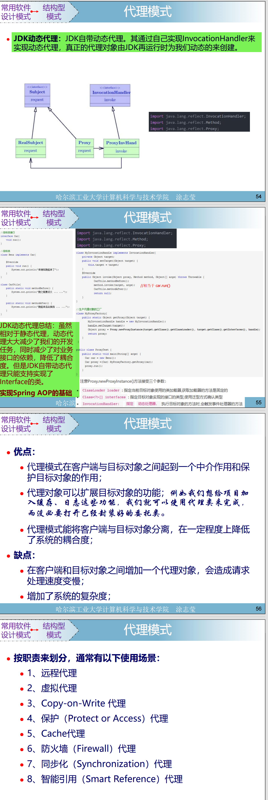

这张图片详细讲解了 **代理模式（Proxy Pattern）**，包括其定义、实现方式（特别是 JDK 动态代理的实现细节）、优缺点和应用场景。以下是详细解析：

---

### 1. **代理模式的核心概念**

- **定义**：代理模式是一种结构型设计模式，通过为目标对象创建一个代理对象来控制对目标对象的访问。
- **作用**：在客户（Client）与目标对象（Real Subject）之间起到一个中介作用，保护目标对象，或为其增加额外功能。

---

### 2. **JDK 动态代理的介绍**

- **动态代理的特点**：
  - 代理类在程序运行时动态生成，而不是在编译时确定。
  - 通过实现 `InvocationHandler` 接口，并结合 `Proxy.newProxyInstance()` 方法实现。
- **核心类和接口**：
  - **`java.lang.reflect.InvocationHandler`**：定义了 `invoke` 方法，用于处理代理实例的方法调用。
  - **`java.lang.reflect.Proxy`**：用于动态创建代理对象。
- **实现动态代理的三个关键步骤**：
  1. **ClassLoader**：加载目标类和代理类。
  2. **Interface**：目标类必须实现的接口。
  3. **InvocationHandler**：代理类的方法调用最终会交由 `invoke` 方法处理。

#### 动态代理的示意图

- 图中展示了动态代理的类关系：
  - 客户端调用代理对象的方法。
  - 代理对象内部会将方法调用委托给 `InvocationHandler` 的 `invoke` 方法。
  - `InvocationHandler` 再将调用转发到目标对象（`RealSubject`）。

---

### 3. **JDK 动态代理的代码实现**

- **`InvocationHandler` 实现类**：`MyInvocationHandler`
  - `MyInvocationHandler` 接受一个目标对象，并将方法调用转发给目标对象。
  - 在 `invoke` 方法中可以添加自定义逻辑（例如：日志记录）。
- **创建代理对象的方法**：

  ```java
  public Object getProxy(Object target) {
      this.target = target;
      return Proxy.newProxyInstance(
          target.getClass().getClassLoader(),
          target.getClass().getInterfaces(),
          this);
  }
  ```

  - 通过 `Proxy.newProxyInstance` 方法创建代理对象。
- **测试代码**：
  - 用代理对象调用目标方法（如 `car.run()`），在调用时会触发代理逻辑。

#### 动态代理的优点

- 动态代理相比静态代理，减少了开发任务：
  - 无需为每个目标类手动编写代理类。
  - 减少了重复代码，降低系统维护成本。

---

### 4. **代理模式的优点和缺点**

#### **优点**

1. **功能扩展**：
   - 可以在不修改目标类代码的情况下，扩展其功能（如日志、权限控制）。
2. **解耦**：
   - 客户端与目标对象解耦，提高了系统灵活性和可维护性。

#### **缺点**

1. **性能开销**：
   - 增加了额外的代理对象，会带来一定的性能开销。
2. **复杂性增加**：
   - 增加了系统的复杂度，特别是动态代理需要更多的学习和理解成本。

---

### 5. **代理模式的使用场景**

根据职责划分，代理模式可分为以下几种常见场景：

1. **远程代理**：用于处理远程对象的调用。
2. **虚拟代理**：通过代理模式延迟加载某些资源，减少系统资源消耗。
3. **Copy-on-Write 代理**：在写操作时复制对象。
4. **保护代理**：控制对目标对象的访问权限。
5. **缓存代理**：对结果进行缓存，减少重复计算。
6. **防火墙代理**：保护系统免受外部访问。
7. **同步代理**：控制对目标对象的并发访问。
8. **智能引用代理**：在访问对象时添加额外功能（如引用计数、垃圾回收等）。

---

### 6. **总结**

- **JDK 动态代理** 是实现代理模式的一种重要方式，尤其适用于接口驱动的开发。
- 它在 Spring AOP（面向切面编程）中具有广泛应用，借助动态代理可以实现方法拦截、日志记录、事务管理等功能。

---

这张图片主要讲解了 **代理模式（Proxy Pattern）** 中 **JDK 动态代理** 的实现方式，及其在开发中的应用。以下是详细解析：

---

### 1. **JDK动态代理简介**

- **定义**：
  - JDK 动态代理是一种动态生成代理类的方式，代理类在运行时生成，而不是事先编译好的类。
  - 它通过实现 `InvocationHandler` 接口和调用 `Proxy` 类提供的方法，实现动态代理。
- **实现原理**：
  - **核心接口：`InvocationHandler`**
    - 代理逻辑的核心接口。
    - 包含 `invoke` 方法，用于处理代理类对目标方法的调用。
  - **`Proxy` 类**
    - 提供 `newProxyInstance` 方法动态生成代理对象。

---

### 2. **JDK动态代理的示意图**

- 图中展示了 JDK 动态代理的类关系：
  - `Subject`：定义目标对象的接口。
  - `RealSubject`：目标对象的具体实现类，实际处理业务逻辑。
  - `Proxy`：代理对象，通过 `InvocationHandler` 的 `invoke` 方法调用目标对象。
  - `InvocationHandler`：处理代理类对目标方法的调用逻辑。

---

### 3. **JDK动态代理的代码实现**

图片提供了代码的实现步骤，具体解析如下：

#### **1. 定义接口与目标类**

- 定义目标接口 `Car`，包含目标方法 `run`。

  ```java
  interface Car {
      void run();
  }
  ```

- 定义目标类 `Benzi`，实现 `Car` 接口：

  ```java
  class Benzi implements Car {
      @Override
      public void run() {
          System.out.println("奔弛车开始运行...");
      }
  }
  ```

#### **2. 实现 InvocationHandler**

- 创建自定义的 `InvocationHandler` 实现类：

  ```java
  class MyInvocationHandler implements InvocationHandler {
      private Object target;

      public void setTarget(Object target) {
          this.target = target;
      }

      @Override
      public Object invoke(Object proxy, Method method, Object[] args) throws Throwable {
          // 增强功能：例如日志、权限控制等
          System.out.println("方法调用前：记录日志...");
          Object result = method.invoke(target, args);
          System.out.println("方法调用后：记录日志...");
          return result;
      }
  }
  ```

  - **`setTarget` 方法**：设置目标对象。
  - **`invoke` 方法**：拦截代理类的方法调用，可以在调用前后添加自定义逻辑，例如日志记录。

#### **3. 创建代理对象**

- 使用 `Proxy.newProxyInstance` 方法动态生成代理对象：

  ```java
  public static Object getProxy(Object target) {
      MyInvocationHandler handler = new MyInvocationHandler();
      handler.setTarget(target);
      return Proxy.newProxyInstance(
          target.getClass().getClassLoader(),
          target.getClass().getInterfaces(),
          handler);
  }
  ```

#### **4. 测试代理逻辑**

- 创建目标对象，并通过代理调用目标方法：

  ```java
  public class ProxyTest {
      public static void main(String[] args) {
          Car car = new Benzi();  // 创建目标对象
          Car proxyCar = (Car) MyProxyFactory.getProxy(car);  // 获取代理对象
          proxyCar.run();  // 调用代理对象的方法
      }
  }
  ```

  - **代理对象的调用过程**：
    - `proxyCar.run()` 调用会被代理逻辑拦截。
    - 执行 `MyInvocationHandler` 中的 `invoke` 方法。
    - `invoke` 方法中通过 `method.invoke(target, args)` 调用实际的目标方法。

---

### 4. **JDK动态代理的优点**

- **减少开发任务**：动态代理无需为每个目标类单独编写代理类。
- **降低耦合**：动态代理通过接口实现，使得客户端和目标类之间的依赖更加松散。
- **灵活性**：可以在运行时动态生成代理类，添加额外功能（如日志、权限控制）。

---

### 5. **JDK动态代理的局限性**

- **仅支持接口**：JDK动态代理只能代理实现了接口的类。
- **性能开销**：由于需要使用反射机制，会比直接调用方法稍慢。

---

### 6. **JDK动态代理与 Spring AOP**

- Spring 的 AOP（面向切面编程）广泛应用了动态代理：
  - 通过动态代理机制，拦截方法调用，在方法前后添加切面逻辑（如事务管理、日志记录）。
  - JDK 动态代理是实现 Spring AOP 的基础之一。

---

### 7. **总结**

- JDK 动态代理是一种强大的设计模式工具，适用于需要在方法调用前后添加功能的场景。
- 它通过 `Proxy` 和 `InvocationHandler` 实现代理逻辑，具有高扩展性和低耦合的优点。
- 实现过程中需要目标类实现接口，这是其使用的前提条件。

以上是对图片中内容的详细解析。若有具体问题，可进一步讨论！

---

以下是对代码 `Proxy.newProxyInstance` 的详细解析，这段代码的作用是**动态生成代理对象**。让我们逐步分析其中的三个参数，以及其工作原理和作用。

---

### 代码背景

- **`Proxy.newProxyInstance` 方法**：
  - 这是 JDK 提供的核心方法，用于生成动态代理对象。
  - 返回值是一个实现了目标接口的代理对象。

---

### **代码结构**

```java
return Proxy.newProxyInstance(
    target.getClass().getClassLoader(), // 参数1：类加载器
    target.getClass().getInterfaces(), // 参数2：目标类实现的接口
    handler                              // 参数3：InvocationHandler 实例
);
```

### **三个参数的作用**

#### **参数1：`target.getClass().getClassLoader()`**

- **含义**：目标类的类加载器（`ClassLoader`）。
- **作用**：
  - 代理类是在运行时动态生成的，而生成的代理类需要由一个类加载器加载到 JVM 中。
  - 这里使用的是目标类的类加载器，使代理类与目标类在同一环境中运行。
- **总结**：
  - 代理类的类加载器一般选择目标类的类加载器（`target.getClass().getClassLoader()`），以确保代理类与目标类兼容。

---

#### **参数2：`target.getClass().getInterfaces()`**

- **含义**：目标类所实现的接口数组（`Class<?>[]`）。
- **作用**：
  - 动态代理的核心限制之一是只能为实现了接口的类生成代理对象。
  - JDK 动态代理要求代理对象必须实现目标类的所有接口，以保证代理对象能够替代目标对象。
- **总结**：
  - 代理类会实现这些接口，因此代理类与目标类的接口完全一致，客户端通过这些接口访问代理对象即可。

---

#### **参数3：`handler`**

- **含义**：`InvocationHandler` 接口的实现类实例。
- **作用**：
  - 每当代理对象的方法被调用时，调用会被转发到 `handler` 的 `invoke` 方法。
  - 在 `invoke` 方法中可以：
    - 调用目标对象的方法（通过反射实现）。
    - 添加额外功能（如日志记录、权限校验等）。
- **关键点**：
  - `handler` 是实现代理功能的核心，负责拦截代理对象的所有方法调用并进行处理。
  - 方法签名：

    ```java
    Object invoke(Object proxy, Method method, Object[] args) throws Throwable;
    ```

    - `proxy`：代理对象本身。
    - `method`：被调用的方法对象。
    - `args`：方法调用时传递的参数。

---

### **方法的返回值**

- 返回值是一个**代理对象**：
  - 代理对象实现了目标类的接口。
  - 代理对象的方法调用会被 `InvocationHandler` 的 `invoke` 方法拦截并处理。

---

### **工作原理总结**

1. **动态生成代理类**：
   - 在运行时，根据目标类的接口信息生成代理类的字节码。
2. **加载代理类**：
   - 通过指定的类加载器将代理类加载到 JVM 中。
3. **创建代理对象**：
   - 实例化代理类，并将 `InvocationHandler` 实例与代理对象绑定。

---

### **完整的调用流程**

1. **创建目标对象**：

   ```java
   Car car = new Benzi();
   ```

   - 目标对象 `car` 是目标类的实例。

2. **创建代理对象**：

   ```java
   Car proxyCar = (Car) Proxy.newProxyInstance(
       car.getClass().getClassLoader(),
       car.getClass().getInterfaces(),
       handler
   );
   ```

   - 创建一个实现了 `Car` 接口的代理对象。

3. **调用代理对象的方法**：

   ```java
   proxyCar.run();
   ```

   - 客户端调用代理对象的方法时，调用会被转发到 `handler` 的 `invoke` 方法中：

     ```java
     @Override
     public Object invoke(Object proxy, Method method, Object[] args) throws Throwable {
         // 代理逻辑：调用目标对象的方法
         Object result = method.invoke(target, args);
         return result;
     }
     ```

---

### **动态代理的核心优势**

1. **无需提前编写代理类**：
   - 使用动态代理可以在运行时为任意实现了接口的类生成代理对象，避免了手动编写代理类的繁琐工作。
2. **增强功能的灵活性**：
   - 在 `InvocationHandler` 中可以对目标对象的每个方法进行统一的处理，例如日志记录、权限校验、事务管理等。

---

### **应用场景**

- **Spring AOP（面向切面编程）**：
  - Spring 中基于 JDK 动态代理，可以在方法执行前后添加增强逻辑。
- **RPC 框架**：
  - 通过动态代理生成远程服务的代理对象，隐藏底层通信细节。
- **缓存代理**：
  - 在方法调用时检查缓存数据，如果命中缓存就直接返回结果，否则调用目标方法。

---

### **总结**

`Proxy.newProxyInstance` 方法的核心作用是**在运行时动态生成一个代理对象**，并将所有对代理对象的方法调用转发到 `InvocationHandler` 处理。通过这三个参数的配合，实现了动态代理的灵活性和扩展性，广泛应用于现代 Java 框架和工具中。
