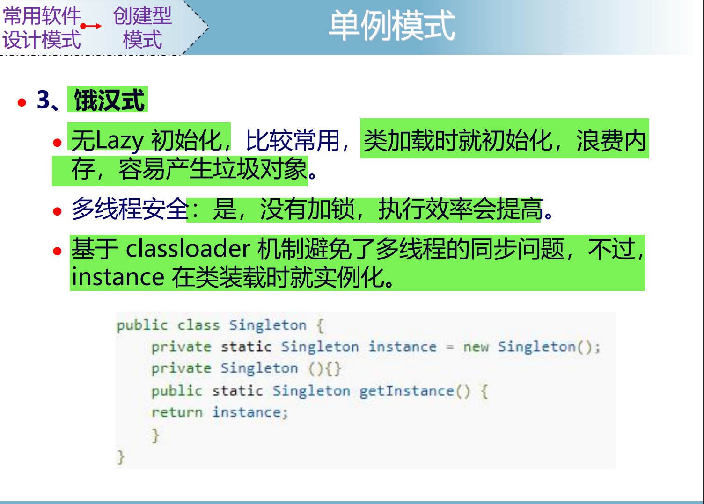
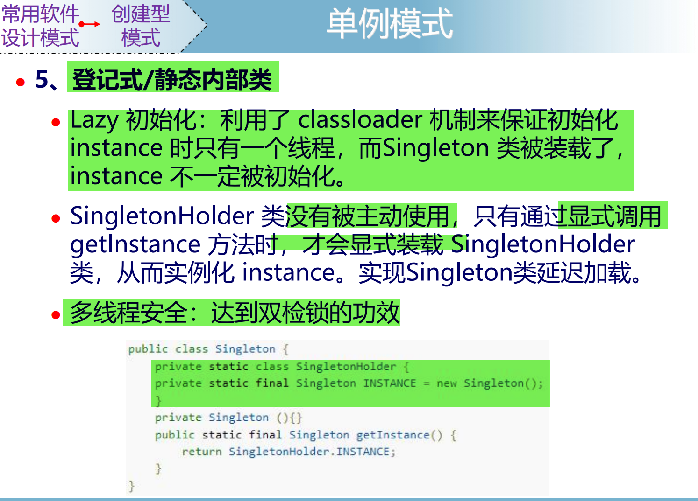

这张图详细介绍了**单例模式**中的一种实现方式——**饿汉式**，下面我将逐条分析其特点及其代码实现，并详细说明。

---

### 1. **饿汉式单例模式简介**

- 饿汉式单例是一种**在类加载时就完成实例化**的单例模式。
- 它的特点是：
  - **立即加载**：在类加载的时候就创建了唯一的实例。
  - **多线程安全**：由于实例的创建是在类加载阶段完成的，Java 的类加载机制天然是线程安全的，所以不需要额外的同步处理。
  - **性能高**：没有锁的开销，执行效率高。

---

### 2. **主要特点**

#### （1）无 Lazy 初始化

- **“无 Lazy 初始化”** 表示实例化不是在第一次调用时（懒加载），而是在类加载时立即完成。
- 优点：
  - 简单，线程安全，不需要额外的同步机制。
  - 适用于单例实例在系统中始终需要被使用的情况。
- 缺点：
  - **内存浪费**：如果这个单例实例在某些情况下未被使用，那么会浪费内存。

---

#### （2）线程安全性

- **多线程安全**：饿汉式依赖于 Java 的类加载机制，JVM 保证类加载的线程安全性。因为类加载时，静态变量的初始化是由 JVM 控制的。
- 在饿汉式实现中，不需要额外的同步代码来保证线程安全，因此**效率更高**。

---

#### （3）基于 ClassLoader 的机制

- 饿汉式利用了 Java 的 **ClassLoader 机制** 来避免多线程环境下的同步问题。
- 类加载过程：
  - 当 JVM 加载一个类时，它会确保类的静态变量和静态代码块在类加载的过程中被初始化且只执行一次。
  - 因此，饿汉式的单例实例在类加载时创建，就已经是线程安全的。

---

### 3. **代码实现分析**

代码如下：

```java
public class Singleton {
    // 静态变量，初始化时就实例化
    private static final Singleton instance = new Singleton();

    // 私有构造函数，防止外部实例化
    private Singleton() {}

    // 提供全局访问点
    public static Singleton getInstance() {
        return instance;
    }
}
```

#### （1）核心部分

- **静态实例变量**：

  ```java
  private static final Singleton instance = new Singleton();
  ```

  - `static`：静态变量，属于类本身，只加载一次。
  - `final`：确保实例不可重新赋值。

- **私有构造函数**：

  ```java
  private Singleton() {}
  ```

  - 确保外部无法直接实例化对象，强制只能通过 `getInstance()` 方法获取实例。

- **全局访问点**：

  ```java
  public static Singleton getInstance() {
      return instance;
  }
  ```

  - 静态方法，提供统一的方式访问单例实例。

#### （2）执行过程

1. 类加载时：
   - `Singleton` 类的静态变量 `instance` 被初始化，这个过程由 JVM 控制。
   - 此时单例对象已经被创建。
2. 调用 `getInstance()`：
   - 返回已经创建的实例，直接使用，效率高。

---

### 4. **优缺点分析**

#### **优点：**

1. 实现简单，代码易读，逻辑清晰。
2. 天然线程安全，避免了加锁造成的性能开销。
3. 类加载完成时单例实例已经创建，执行效率高。

#### **缺点：**

1. **浪费资源**：
   - 如果单例实例较大且长时间未被使用，那么会占用不必要的内存。
2. **灵活性差**：
   - 如果实例化过程依赖于某些动态参数或配置，则饿汉式无法支持。

---

### 5. **适用场景**

- 饿汉式适用于以下场景：
  1. 系统初始化阶段就需要使用单例实例。
  2. 单例对象轻量，不占用太多资源。
  3. 系统对性能要求高，需要避免加锁同步的开销。

- **不适用场景**：
  - 如果单例对象较重或延迟加载更合适（可以考虑懒汉式或双重检查锁模式）。

---

### 6. **对比其他单例实现**

#### **饿汉式 VS 懒汉式**

| 特性                | 饿汉式                          | 懒汉式                         |
|---------------------|---------------------------------|--------------------------------|
| 实例化时机          | 类加载时完成                   | 第一次调用时完成              |
| 是否线程安全        | 是                             | 需要额外处理（如加锁）        |
| 实现复杂度          | 简单                           | 较复杂                       |
| 性能               | 高（无锁开销）                 | 可能因加锁导致性能下降       |
| 是否支持延迟加载    | 否                             | 是                           |

---

### 总结

- **饿汉式单例模式**是一种简单且高效的单例实现方式，依赖于 JVM 的类加载机制，线程安全且性能优越。
- 它适用于系统初始化时就需要单例实例的场景，但需要注意内存浪费的问题。
- 对于延迟加载需求较高或内存敏感的场景，可以选择其他单例实现方式。

---

### **1. 为什么在类加载时就完成实例化是线程安全的？**

在 **Java 的类加载过程** 中，JVM 的类加载机制可以确保线程安全。这是因为类加载和类初始化的过程是**由 JVM 严格控制的，并且是线程同步的**。

#### （1）**类加载的过程**

Java 的类加载主要分为三个步骤：

1. **加载（Loading）**：将类的 `.class` 文件加载到内存中，生成对应的 `Class` 对象。
2. **验证（Verification）**：确保加载的类的字节码是合法的。
3. **准备（Preparation）和解析（Resolution）**：为类的静态变量分配内存，解析符号引用为直接引用。
4. **初始化（Initialization）**：初始化类的静态变量和静态代码块。

在 **初始化阶段**，JVM 会为类的静态变量赋值，并执行静态代码块。

#### （2）**线程安全保证**

- **JVM 保证类加载过程的同步性**：  
  Java 虚拟机规范规定，同一个类在同一时间只能由一个线程完成加载和初始化。也就是说，**一个类只会被加载一次**，并且类的加载和初始化过程是线程安全的。
- **类加载时静态变量的初始化是线程安全的**：  
  由于类加载是一个原子操作，静态变量（如 `private static final Singleton instance`）的赋值操作只会在类加载时执行一次，多个线程无法干扰。

因此，在饿汉式单例模式中，静态变量的实例化是在类加载的初始化阶段完成的，由 JVM 保证线程安全。

---

### **2. 什么是 ClassLoader 机制？**

**ClassLoader（类加载器）** 是 JVM 中的一部分，它负责将类的字节码加载到 JVM 中并转化为 `Class` 对象。

#### （1）**ClassLoader 的作用**

1. **加载类**：将 `.class` 文件加载到内存中，生成 `Class` 对象。
2. **命名空间隔离**：不同的类加载器可以加载同名的类，而这些类在 JVM 中会被视为完全不同的类。
3. **双亲委派模型**：保证类加载的安全性和稳定性。

---

#### （2）**双亲委派模型**

双亲委派模型是 ClassLoader 的一种工作机制，用于确定类加载的顺序。它的核心思想是：  
**当一个类加载器加载某个类时，它会优先将加载请求委派给父加载器完成，只有当父加载器无法完成时，才会自己尝试加载。**

加载顺序：

1. **Bootstrap ClassLoader**（引导类加载器）：
   - 负责加载 Java 核心类库（如 `java.lang.*`）。
2. **Extension ClassLoader**（扩展类加载器）：
   - 负责加载 Java 扩展类库（如 `JAVA_HOME/lib/ext` 下的类）。
3. **Application ClassLoader**（应用类加载器）：
   - 负责加载应用程序的类。

这种机制可以避免重复加载类，保证核心类的安全。

---

#### （3）**ClassLoader 机制与单例模式的关系**

- 饿汉式单例模式依赖于 ClassLoader 的类加载过程。
- 静态变量 `private static final Singleton instance` 会在类的初始化阶段（类加载完成后）由 JVM 自动初始化，这个过程是线程安全的。
- JVM 确保类的初始化过程只执行一次，因此饿汉式单例是天然线程安全的。

---

### **3. 总结**

- **在类加载时完成实例化为什么线程安全？**  
  因为类加载和类初始化过程是由 JVM 控制的，JVM 确保类加载过程的同步性，静态变量在类初始化阶段只会被赋值一次。

- **ClassLoader 机制是什么？**  
  ClassLoader 是负责将类的字节码加载到 JVM 的组件，它通过双亲委派模型来保证类加载的安全性和稳定性。饿汉式单例模式依赖于 ClassLoader 的初始化机制，确保静态变量的线程安全初始化。

这就是为什么饿汉式单例的实现无需额外加锁就能保证线程安全的原因。

---



这张图详细介绍了**单例模式**中的一种实现方式——**静态内部类（登记式单例）**，下面将详细解释其工作原理、线程安全性以及优势。

---

### **1. 什么是静态内部类单例模式？**

静态内部类单例模式是利用 **Java 的类加载机制**和**静态内部类特性**实现的一种延迟加载（Lazy Initialization）的单例模式。它结合了饿汉式和懒汉式的优点，既能实现线程安全，又支持延迟加载。

---

### **2. 静态内部类单例模式的实现方式**

代码如下：

```java
public class Singleton {
    // 静态内部类
    private static class SingletonHolder {
        private static final Singleton INSTANCE = new Singleton();
    }

    // 私有化构造函数，防止外部实例化
    private Singleton() {}

    // 提供全局访问点
    public static Singleton getInstance() {
        return SingletonHolder.INSTANCE;
    }
}
```

---

### **3. 关键点详解**

#### **（1）Lazy 初始化（延迟加载）**

- **延迟加载的原因**：  
  `SingletonHolder` 是一个静态内部类，只有在第一次通过调用 `getInstance()` 方法访问 `SingletonHolder.INSTANCE` 时，`SingletonHolder` 类才会被加载和初始化。  
  这就实现了延迟加载，即单例实例只有在需要时才会被初始化。

- **类加载时机**：  
  - 当 `Singleton` 类被加载时，静态内部类 `SingletonHolder` 并不会被加载。
  - 只有在调用 `getInstance()` 方法时，`SingletonHolder` 才会被显式加载。
  - 因此，`INSTANCE` 的初始化是延迟到第一次访问时才进行的。

---

#### **（2）基于 ClassLoader 的线程安全性**

- **ClassLoader 机制的支持**：  
  类加载是线程安全的，JVM 保证同一个类在多线程环境下的类加载过程是同步的。  
  当 `SingletonHolder` 类被加载时，其静态变量 `INSTANCE` 会由 JVM 负责初始化，且这个过程是线程安全的。

- **与双重检查锁相比的优势**：  
  静态内部类模式避免了加锁操作（如 `synchronized` 或双重检查锁），实现了更高的执行效率。

---

#### **（3）多线程安全性**

- **线程安全的实现**：  
  静态变量 `INSTANCE` 的初始化由 JVM 控制，这个过程是天然线程安全的。
- **避免了额外的同步操作**：  
  相较于懒汉式需要加锁确保线程安全，静态内部类单例模式的实现不需要额外的同步操作，因此性能更高。

---

### **4. 优势和特点**

#### **（1）延迟加载**

- 单例实例的初始化延迟到第一次调用 `getInstance()` 方法时进行，避免了饿汉式的资源浪费。

#### **（2）线程安全**

- 利用 JVM 的类加载机制，保证了线程安全性，而不需要显式的同步机制。

#### **（3）实现简单**

- 代码简洁，没有使用复杂的加锁或双重检查机制。

#### **（4）效率高**

- 由于没有使用锁机制或同步操作，运行时性能高，特别适合高并发场景。

---

### **5. 与其他单例模式的对比**

#### **与饿汉式**

- 饿汉式在类加载时就完成实例化，不能实现延迟加载。
- 静态内部类模式可以延迟实例化，且实现更灵活。

#### **与懒汉式（线程安全版）**

- 懒汉式需要通过 `synchronized` 或双重检查锁来保证线程安全，但这些操作会影响性能。
- 静态内部类模式利用 JVM 的机制实现线程安全，不需要锁，性能更高。

#### **与双重检查锁**

- 双重检查锁模式实现复杂，代码较冗长。
- 静态内部类模式实现简单，且更加高效。

---

### **6. 总结和适用场景**

#### **总结**

- 静态内部类单例模式结合了饿汉式和懒汉式的优点：线程安全、延迟加载、实现简单。
- 通过使用静态内部类，单例实例的初始化时机被延迟到了第一次调用时，避免了饿汉式可能导致的资源浪费。

#### **适用场景**

- 希望实现延迟加载，并且需要高效的线程安全单例。
- 不希望引入复杂的锁机制和额外的同步操作。

---

如果有进一步的疑问或需要扩展其他实现方式，欢迎继续提问！
