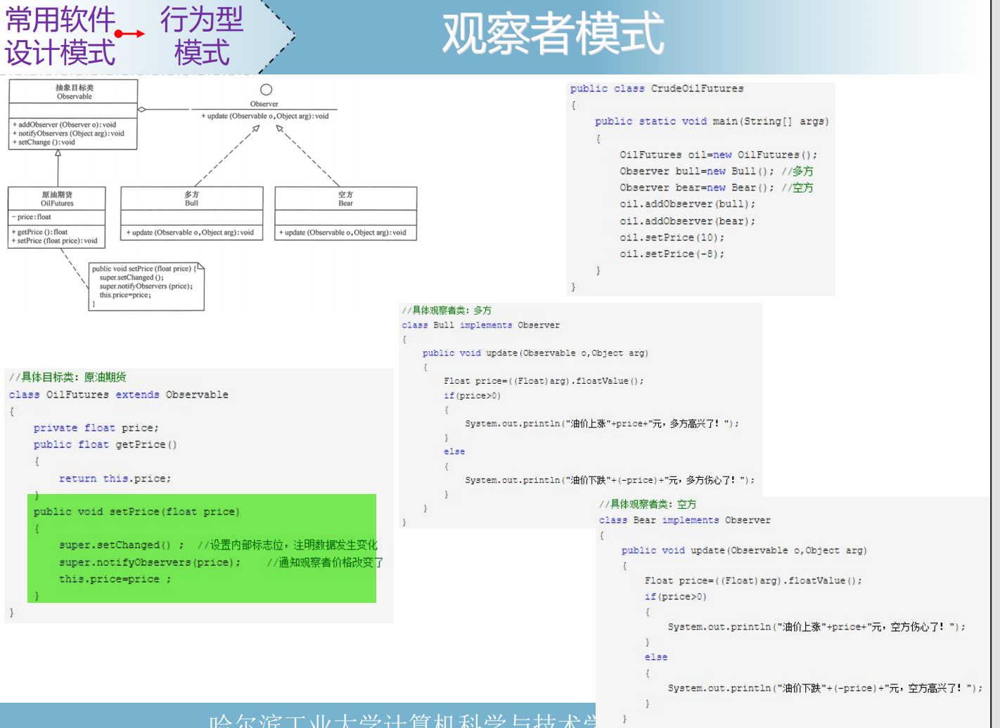

这张图片讲解了 **观察者模式（Observer Pattern）** 的设计思路及具体实现。下面是对图片内容的详细解析：

---

### **1. 观察者模式的定义**

- **定义**：
  - 观察者模式是一种行为型设计模式，它定义了对象间的一对多依赖关系。当一个对象的状态发生改变时，所有依赖它的对象都会收到通知并自动更新。
- **结构**：
  - **`Subject`（被观察者）**：
    - 维护观察者列表，并提供方法添加、删除观察者。
    - 当状态发生变化时，负责通知所有观察者。
  - **`Observer`（观察者）**：
    - 定义一个接口，包含更新方法（`update()`）。
    - 当被观察者状态变化时，执行特定逻辑。

---

### **2. UML类图分析**

图片展示了观察者模式的核心类图：

- **`Observable`（被观察者）**：
  - 核心功能：
    - `addObserver(Observer o)`：添加观察者。
    - `deleteObserver(Observer o)`：删除观察者。
    - `notifyObservers(Object arg)`：通知所有观察者。
  - 被观察者发生变化时，调用 `setChanged()` 标记状态改变，再调用 `notifyObservers()` 通知观察者。
- **`Observer`（观察者接口）**：
  - 定义了一个 `update(Observable o, Object arg)` 方法，用于响应被观察者的通知。

---

### **3. 实现代码解析**

#### **(1) 被观察者类：`OilFutures`**

```java
class OilFutures extends Observable {
    private float price;

    public float getPrice() {
        return this.price;
    }

    public void setPrice(float price) {
        super.setChanged(); // 标记状态改变
        super.notifyObservers(price); // 通知所有观察者，并传递新价格
        this.price = price;
    }
}
```

- **类描述**：
  - `OilFutures` 继承自 `Observable`，实现原油期货价格的管理。
- **主要功能**：
  1. **`setPrice(float price)`**：
     - 调用 `setChanged()` 标记被观察者的状态已发生变化。
     - 调用 `notifyObservers(price)` 通知所有观察者，传递最新价格。
  2. **价格变动后**：
     - 每个观察者的 `update` 方法会被调用。

---

#### **(2) 观察者类：`Bull` 和 `Bear`**

- **多方（`Bull`）观察者**：

  ```java
  class Bull implements Observer {
      public void update(Observable o, Object arg) {
          Float price = ((Float) arg).floatValue(); // 获取新价格
          if (price > 0) {
              System.out.println("油价上涨" + price + "元，多方欢呼了！");
          } else {
              System.out.println("油价下跌" + price + "元，多方伤心了！");
          }
      }
  }
  ```

  - **实现功能**：
    - 获取最新价格（`arg` 参数）。
    - 根据价格涨跌输出不同的消息。
    - 多方会在油价上涨时高兴，油价下跌时伤心。

- **空方（`Bear`）观察者**：

  ```java
  class Bear implements Observer {
      public void update(Observable o, Object arg) {
          Float price = ((Float) arg).floatValue(); // 获取新价格
          if (price > 0) {
              System.out.println("油价上涨" + price + "元，空方伤心了！");
          } else {
              System.out.println("油价下跌" + price + "元，空方欢呼了！");
          }
      }
  }
  ```

  - **实现功能**：
    - 获取最新价格（`arg` 参数）。
    - 根据价格涨跌输出不同的消息。
    - 空方会在油价上涨时伤心，油价下跌时高兴。

---

#### **(3) 测试类：`CrudeOilFutures`**

```java
public class CrudeOilFutures {
    public static void main(String[] args) {
        OilFutures oil = new OilFutures(); // 创建被观察者对象

        Observer bull = new Bull(); // 创建多方观察者
        Observer bear = new Bear(); // 创建空方观察者

        oil.addObserver(bull); // 添加观察者
        oil.addObserver(bear);

        oil.setPrice(10); // 通知：油价上涨
        oil.setPrice(-8); // 通知：油价下跌
    }
}
```

- **测试逻辑**：
  1. 创建被观察者 `OilFutures` 对象。
  2. 创建观察者 `Bull` 和 `Bear`。
  3. 使用 `addObserver` 方法，将两个观察者注册到被观察者中。
  4. 调用 `setPrice(10)`，模拟油价上涨，触发通知。
  5. 调用 `setPrice(-8)`，模拟油价下跌，触发通知。
- **运行结果**：
  - 当油价上涨时：

    ```
    油价上涨10元，多方欢呼了！
    油价上涨10元，空方伤心了！
    ```

  - 当油价下跌时：

    ```
    油价下跌-8元，多方伤心了！
    油价下跌-8元，空方欢呼了！
    ```

---

### **4. 优点与缺点**

#### **优点**

1. **低耦合**：
   - 观察者和被观察者之间是松散耦合关系，被观察者无需知道具体的观察者，符合开闭原则。
2. **动态扩展**：
   - 可以动态添加、删除观察者，灵活性高。
3. **自动通知**：
   - 被观察者状态变化时，观察者会自动收到通知，无需手动调用。

#### **缺点**

1. **性能开销**：
   - 如果观察者数量多，通知过程会有一定的性能开销。
2. **顺序问题**：
   - 多个观察者的通知顺序不确定，可能会导致不可预测的行为。
3. **复杂性**：
   - 如果观察者和被观察者之间的关系较复杂，可能难以维护。

---

### **5. 适用场景**

1. **事件驱动模型**：
   - GUI 系统中按钮点击等事件处理。
2. **数据更新通知**：
   - 数据变化时通知相关组件更新（例如：MVC 模式）。
3. **订阅-发布系统**：
   - 消息队列系统中，主题（Topic）变化时通知所有订阅者。

---

### **总结**

观察者模式是一种非常常见的设计模式，适合用在需要通知多个对象的场景中。通过被观察者和观察者的分离，实现了松耦合设计。在图片示例中，通过模拟原油期货价格的涨跌，展示了观察者模式的灵活性和实用性。这种模式在实际开发中应用广泛，例如 GUI 系统、事件通知系统等。
