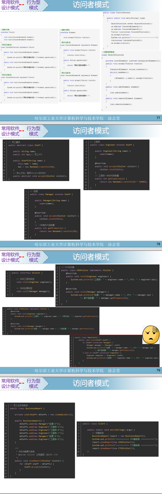

这张图片讲解了 **访问者模式（Visitor Pattern）** 的核心思想及其实现。以下是详细的解析：

---

## **1. 访问者模式的定义**

- **定义**：
  - 访问者模式是一种行为型设计模式，它封装了作用于某种数据结构中各个元素的操作。它允许在不改变数据结构的前提下，定义作用于这些元素的新操作。
- **特点**：
  - **双分派机制**：
    - 第一次分派是根据被访问元素调用对应的 `accept` 方法。
    - 第二次分派是将元素自身传递给访问者的 `visit` 方法，以执行对应的逻辑。
  - 将数据结构与操作分离，使得对同一数据结构可以轻松增加新操作。

---

## **2. 访问者模式的结构**

- UML 类图中展示了访问者模式的核心结构：
  - **`Visitor`（访问者接口）**：
    - 定义了访问每个元素的方法，例如：`visit(ConcreteElementA element)`。
  - **`ConcreteVisitor`（具体访问者）**：
    - 具体的访问者类，实现访问逻辑。
  - **`Element`（元素接口）**：
    - 定义了一个 `accept(Visitor visitor)` 方法。
  - **`ConcreteElement`（具体元素）**：
    - 具体的元素类，实现 `accept` 方法，将自身传递给访问者。
  - **`ObjectStructure`（对象结构）**：
    - 元素的集合类，用于管理元素并让访问者访问。

---

## **3. 访问者模式的代码实现**

### **(1) 定义核心接口**

#### **访问者接口：`Visitor`**

```java
public interface Visitor {
    void visit(Engineer engineer); // 访问工程师
    void visit(Manager manager);   // 访问经理
}
```

- 定义了两个方法，分别针对不同的元素类型。

#### **元素接口：`Staff`**

```java
public abstract class Staff {
    public String name;
    public int kpi;

    public Staff(String name) {
        this.name = name;
        this.kpi = new Random().nextInt(10); // 随机生成 KPI
    }

    public abstract void accept(Visitor visitor); // 接受访问者
}
```

- **`accept` 方法**：
  - 这是访问者模式的核心方法，元素通过这个方法将访问者传递进来。

---

### **(2) 定义具体元素**

#### **工程师类：`Engineer`**

```java
public class Engineer extends Staff {
    public Engineer(String name) {
        super(name);
    }

    @Override
    public void accept(Visitor visitor) {
        visitor.visit(this); // 访问者访问工程师
    }

    public int getCodeLines() {
        return new Random().nextInt(10 * 1000); // 随机生成代码行数
    }
}
```

- 具体实现 `accept` 方法，将自己传递给访问者。

#### **经理类：`Manager`**

```java
public class Manager extends Staff {
    public Manager(String name) {
        super(name);
    }

    @Override
    public void accept(Visitor visitor) {
        visitor.visit(this); // 访问者访问经理
    }

    public int getProducts() {
        return new Random().nextInt(10); // 随机生成产品数量
    }
}
```

- 同样实现了 `accept` 方法，将自己传递给访问者。

---

### **(3) 定义具体访问者**

#### **CEO 访问者：`CEOVisitor`**

```java
public class CEOVisitor implements Visitor {
    @Override
    public void visit(Engineer engineer) {
        System.out.println("工程师：" + engineer.name + ", KPI：" + engineer.kpi);
    }

    @Override
    public void visit(Manager manager) {
        System.out.println("经理：" + manager.name + ", KPI：" + manager.kpi + ", 新产品数量：" + manager.getProducts());
    }
}
```

- CEO 访问者关注：
  - 工程师的 KPI。
  - 经理的 KPI 和新产品数量。

#### **CTO 访问者：`CTOVisitor`**

```java
public class CTOVisitor implements Visitor {
    @Override
    public void visit(Engineer engineer) {
        System.out.println("工程师：" + engineer.name + ", 代码行数：" + engineer.getCodeLines());
    }

    @Override
    public void visit(Manager manager) {
        System.out.println("经理：" + manager.name + ", 产品数量：" + manager.getProducts());
    }
}
```

- CTO 访问者关注：
  - 工程师的代码行数。
  - 经理的产品数量。

---

### **(4) 对象结构类**

#### **对象结构：`BusinessReport`**

```java
public class BusinessReport {
    private List<Staff> staffList = new LinkedList<>();

    public BusinessReport() {
        staffList.add(new Manager("经理A"));
        staffList.add(new Engineer("工程师A"));
        staffList.add(new Engineer("工程师B"));
        staffList.add(new Manager("经理B"));
        staffList.add(new Engineer("工程师C"));
    }

    public void showReport(Visitor visitor) {
        for (Staff staff : staffList) {
            staff.accept(visitor); // 让访问者访问每个员工
        }
    }
}
```

- **功能**：
  - 管理所有员工（元素）。
  - 提供 `showReport(Visitor visitor)` 方法，让访问者访问每个员工并执行相应逻辑。

---

### **(5) 测试类**

#### **客户端：`Client`**

```java
public class Client {
    public static void main(String[] args) {
        BusinessReport report = new BusinessReport(); // 创建报告

        System.out.println("======== CEO 访问报告 ========");
        report.showReport(new CEOVisitor()); // CEO 查看报告

        System.out.println("======== CTO 访问报告 ========");
        report.showReport(new CTOVisitor()); // CTO 查看报告
    }
}
```

- 测试流程：
  1. 创建一个 `BusinessReport`，其中包含若干员工。
  2. CEO 使用 `CEOVisitor` 查看报告，关注 KPI 和新产品数量。
  3. CTO 使用 `CTOVisitor` 查看报告，关注代码行数和产品数量。

---

### **4. 运行结果**

运行程序后会输出类似以下内容：

```
======== CEO 访问报告 ========
经理：经理A, KPI：6, 新产品数量：8
工程师：工程师A, KPI：7
工程师：工程师B, KPI：3
经理：经理B, KPI：5, 新产品数量：4
工程师：工程师C, KPI：9

======== CTO 访问报告 ========
经理：经理A, 产品数量：8
工程师：工程师A, 代码行数：5382
工程师：工程师B, 代码行数：7643
经理：经理B, 产品数量：4
工程师：工程师C, 代码行数：1928
```

---

## **5. 访问者模式的优缺点**

### **优点**

1. **符合开闭原则**：
   - 通过增加新的访问者，可以方便地扩展系统功能，而不需要修改元素类。
2. **功能聚合**：
   - 将针对不同元素的操作逻辑集中在访问者中，便于管理和维护。
3. **灵活性**：
   - 支持对一组对象结构进行不同的操作，访问者可以自由定义操作逻辑。

### **缺点**

1. **违反单一职责原则**：
   - 元素类需要实现 `accept` 方法，与数据和操作耦合。
2. **对象结构的稳定性要求高**：
   - 如果对象结构频繁变化，则需要修改所有访问者类，维护成本较高。
3. **双分派增加复杂性**：
   - 访问者模式的双分派机制增加了理解和实现的复杂度。

---

## **6. 使用场景**

- **需要对对象结构中的元素执行多种操作且操作彼此独立**。
- **元素类很少改变，而操作逻辑经常变化的场景**，例如：
  - 报表生成系统。
  - 编译器语法树处理。
  - 数据结构的遍历和操作（如文件系统）。

---

### **总结**

访问者模式是一种非常有用的设计模式，特别适合对象结构稳定、操作多变的场景。它通过将操作封装在访问者中，实现了操作的灵活扩展和对象结构的解耦。在例子中，CEO 和 CTO 分别关注员工的不同数据，完美体现了访问者模式的优点。
